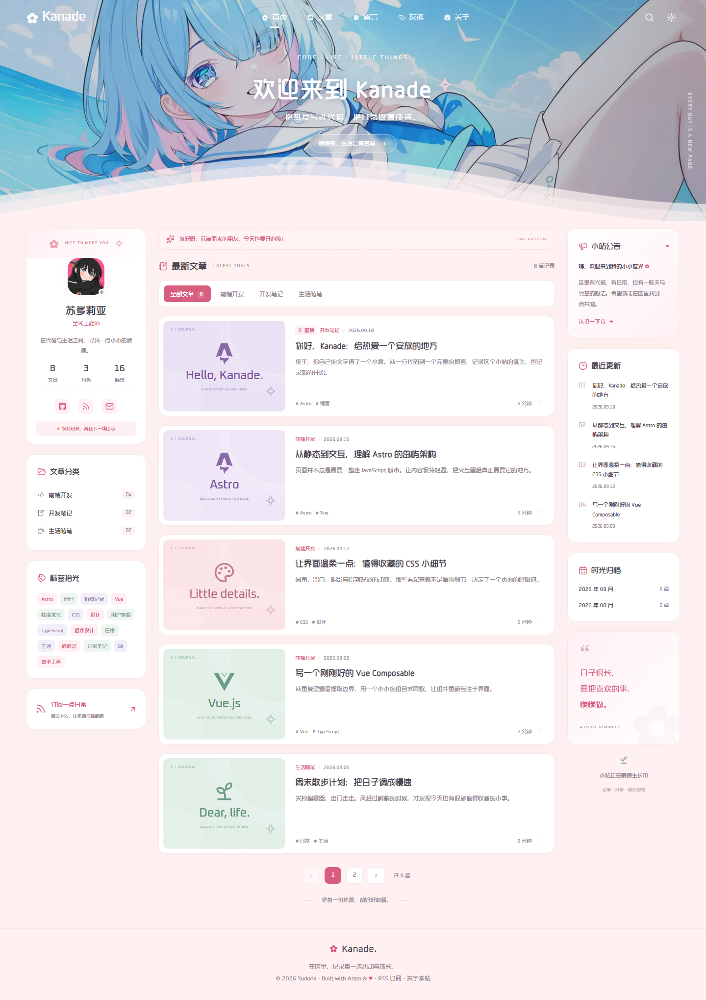
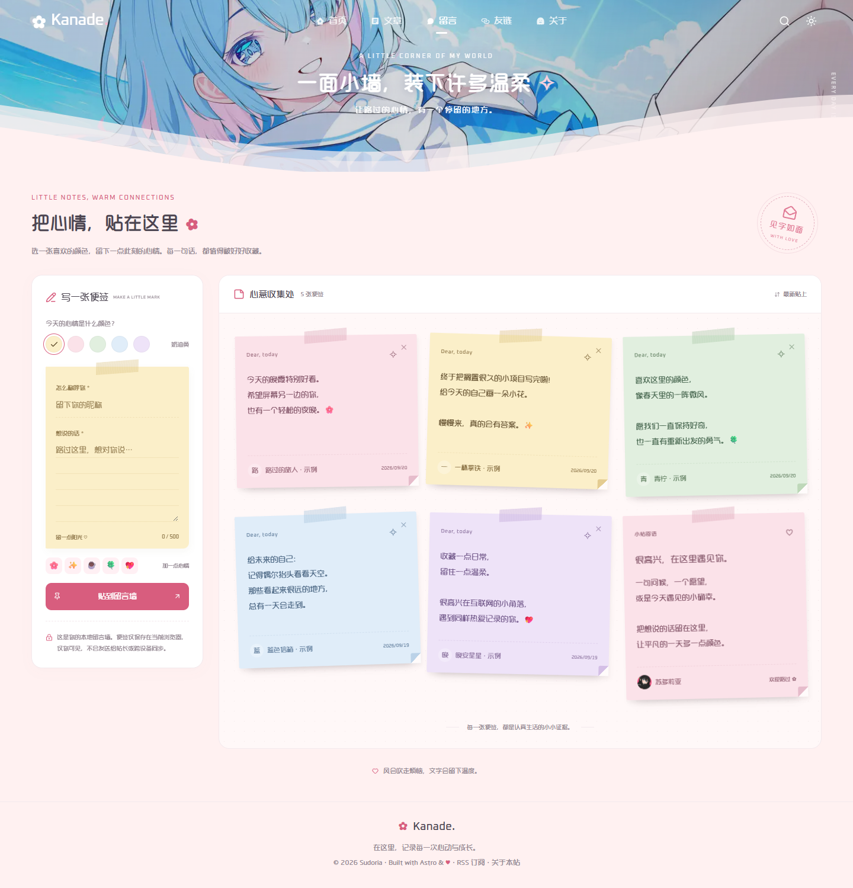

# Kanade · 奏

**この README の言語は日本語です。** この日本語 README とプロジェクトの日本語版は AI によって生成されました。翻訳の誤り、不正確な説明、不具合がありましたら、[プルリクエスト](https://github.com/sudoriaa/Kanade-Astro/pulls)や [Issue](https://github.com/sudoriaa/Kanade-Astro/issues) での修正・ご指摘を歓迎します。

[简体中文](README.md) · [English](README.en.md) · **日本語**

コード、思いつき、日々の出来事を記録する個人ブログです。Astro 7.3、Vue 3、Tailwind CSS 4、TypeScript 6 を使い、イラスト付きのヘッダー、角丸のカード、やわらかな波を組み合わせています。





## 主な機能

- Markdown 記事、カテゴリ、タグ、月別アーカイブ、ページ分割、URL に保存される絞り込み。
- タイトル、概要、翻訳されたカテゴリ、タグの検索。`Ctrl / ⌘ + K` で開き、`Esc` で閉じます。
- コードの色分けとコピー、目次、読書進捗、リンク共有、前後の記事。
- ライト・ダークテーマと設定の保存、モバイルメニュー、キーボード操作、動きを減らす設定への対応。
- プロフィール、リンク、メッセージボード、404 ページ。旧 `/articles/`・`/comments/` からの転送。
- RSS、サイトマップ、robots.txt、canonical URL、Open Graph メタデータ。
- 開発者がビルド前に選ぶ中国語・英語・日本語。各言語にサンプル記事を 8 本用意しています。

ビルド結果は `dist/` の静的 HTML です。操作が必要な Vue コンポーネントをハイドレーションします。データベースは不要です。

## はじめる

Node.js 24 LTS（最低 22.12）と pnpm 10.33.0 を使用してください。`.node-version`、`engines`、`packageManager` に実行環境を定義しています。

```sh
git clone https://github.com/sudoriaa/Kanade-Astro.git
cd Kanade-Astro
pnpm install --frozen-lockfile
pnpm dev
```

[http://localhost:4321](http://localhost:4321) を開きます。

| コマンド                            | 用途                                           |
| ----------------------------------- | ---------------------------------------------- |
| `pnpm dev`                          | 開発サーバーを起動                             |
| `pnpm check`                        | Astro、Vue、TypeScript を検査                  |
| `pnpm build`                        | 型検査後、`dist/` に静的サイトを生成           |
| `pnpm preview`                      | ビルド済みのサイトを確認                       |
| `pnpm test`                         | ビルドとデスクトップ・モバイルのブラウザテスト |
| `pnpm test:e2e`                     | 既存のビルド結果をテスト                       |
| `pnpm format` / `pnpm format:check` | ソースの整形 / 書式確認                        |
| `pnpm deploy:local`                 | Windows でバックグラウンドのプレビューを起動   |

## サイトの表示言語を選ぶ

[src/site.config.json](src/site.config.json) の既存の `language` を変更します。

```json
"language": "ja"
```

指定できる値は `zh-CN`、`en`、`ja` です。初期値は `zh-CN` です。変更後は開発サーバーを再起動してください。公開サイトでは再ビルドし、`dist/` を配信し直します。

ナビゲーション、ページの文章、アクセシビリティ用ラベル、日付、件数、カテゴリ、メタデータ、RSS、フォント、記事が設定に従います。一回のビルドで一つの言語を公開し、`/posts/hello-kanade/` などの URL は共通です。訪問者向けの言語切り替えメニューや、URL の言語プレフィックスは追加していません。

ホスティング環境や `.env` の `PUBLIC_SITE_LANGUAGE` で JSON の設定を上書きできます。PowerShell で一時的に日本語をビルドする例です。

```powershell
$env:PUBLIC_SITE_LANGUAGE = "ja"
pnpm build
pnpm test:e2e
Remove-Item Env:PUBLIC_SITE_LANGUAGE
```

POSIX シェルでは `PUBLIC_SITE_LANGUAGE=ja pnpm build` を使います。ビルドとテストには同じ言語を指定してください。環境変数を解除すると JSON の設定に戻ります。

## 内容を変更する

[src/site.config.json](src/site.config.json) でサイト名、ロゴ文字、favicon、言語別のキーワード、著者名、アバター、ヘッダー画像、ナビゲーション、ソーシャルリンクを管理します。`navigation[].label` と `socialLinks[].label` は翻訳キーです。ソーシャルリンクでは `label` を空にして `name` に直接名前を書けます。URL の `$author.github` は著者の GitHub URL に置き換わります。

`text` では、各言語の既定の文章を上書きできます。たとえば、既存の `text.ja` を次のオブジェクトに置き換えます。

```json
{
  "site.titleSuffix": "開発の記録",
  "site.description": "Web 開発、道具、日々の暮らしについての記録です。",
  "hero.title": "私の小さな場所へようこそ",
  "author.bio": "小さなものを作るのが好きな開発者です。",
  "nav.friends": "ブックマーク"
}
```

`text` の他の言語も残してください。キーと既定の文章は [src/i18n/ja.json](src/i18n/ja.json)、[en.json](src/i18n/en.json)、[zh-CN.json](src/i18n/zh-CN.json) で確認できます。`{site}`、`{name}`、`{count}` などの置換用文字列を保ってください。英語の件数表示には単数用の `.one` キーもあるため、文面を変える際にはそちらも更新します。日付と複数形には `Intl` を使っています。

| 場所                       | 内容                                          |
| -------------------------- | --------------------------------------------- |
| `src/config.ts`            | コンポーネントが使用する型付きの設定          |
| `src/i18n/`                | 翻訳辞書と日付などの補助関数                  |
| `src/data/friends.ts`      | リンク、アイコン、色、翻訳付きの説明          |
| `src/data/post-options.ts` | 共通のカテゴリ ID とカバー形式                |
| `src/styles/global.css`    | 色、余白、フォント、画面幅への対応            |
| `src/content/posts/`       | 中国語記事。`en/` と `ja/` に各言語の記事     |
| `public/images/`           | アバターとヘッダー画像                        |
| `public/fonts/`            | 元のフォントと配布用ライセンス                |
| `src/pages/`               | ページ、記事詳細、RSS、サイトマップ互換ルート |
| `tests/blog.spec.ts`       | 動作と表示言語のブラウザテスト                |

レイアウトが `image/svg+xml` を指定しているため、favicon には SVG を使ってください。

## 記事を書く

`src/content/posts/ja/my-first-post.md` を作成します。

```markdown
---
title: "最初の記事"
description: "一覧、検索、メタデータ用の短い概要です。"
date: 2026-09-20
lang: ja
category: notes
tags: ["Astro", "ブログ"]
cover: notes
featured: false
draft: false
---

## ここから始める

残しておきたいことを書きます。
```

日本語を選択したビルドでは `/posts/my-first-post/` になります。英語は `src/content/posts/en/` に置き、`lang: en` を指定します。中国語はコンテンツの直下に置き、`lang: zh-CN` を指定できます（省略時もこの値です）。言語のディレクトリ名は記事の公開 URL から取り除きます。翻訳版には同じファイル名を使い、同じ言語内では重複させないでください。

選んだ言語と `lang` が一致する公開記事だけが、ページ、検索、RSS、サイトマップに含まれます。未翻訳の記事を中国語で補う動作はありません。ビルド時には全言語の記事形式を検査します。`_` で始まるファイルはコレクションから除外します。

| 項目                    | 必須   | 内容                                   |
| ----------------------- | ------ | -------------------------------------- |
| `title` / `description` | はい   | タイトルと概要                         |
| `date`                  | はい   | 公開日。`YYYY-MM-DD` を推奨            |
| `lang`                  | いいえ | `zh-CN`、`en`、`ja`。既定値は `zh-CN`  |
| `category`              | はい   | `frontend`、`notes`、`life` のいずれか |
| `tags`                  | はい   | タグの配列。空配列も使用可能           |
| `cover`                 | はい   | 次のカバー形式から選択                 |
| `featured`              | いいえ | 注目マークとカバー。既定値は `false`   |
| `draft`                 | いいえ | 公開対象から除外。既定値は `false`     |

カバー形式：`astro`、`vue`、`css`、`notes`、`life`、`typescript`、`git`、`design`。カテゴリは言語共通の ID を使い、画面では翻訳した名前を表示します。既存の中国語カテゴリ名も互換性のため受け付けます。タグや記事本文は各 Markdown ファイルで編集します。

記事は日付の新しい順です。`featured` は表示を変え、並び順は変えません。読書時間は、英語が毎分 200 語、中国語が毎分 400 字、日本語が毎分 500 字として概算します。検索はタイトル、概要、カテゴリ、タグが対象で、記事全文は対象に含みません。

## ローカルフォント

英語は **Noto Sans Variable**、日本語は **Noto Sans JP Variable** を使用します。中国語は元のフォントを残し、**Noto Sans SC Variable** を補助に使います。コードは **JetBrains Mono Variable** と同梱の CJK フォントを使用します。装飾用の元の Oxanium にも、表示言語に応じた補助フォントを設定しています。

Fontsource のパッケージをビルド時にローカルの WOFF2 にまとめます。ブラウザは Unicode 範囲に応じて必要な部分を読み込みます。公開時に Google Fonts や外部のフォント CDN へ接続せず、英語と日本語は同梱フォントで表示します。追加した四種類のライセンスは [public/fonts/licenses/](public/fonts/licenses/) に含めています。

## メッセージボードについて

色付きのメモは、現在のブラウザの `localStorage` に保存します。そのブラウザの利用者だけが見ることができ、サイト管理者への送信や端末間の同期は行いません。

五色の紙、並び替え、削除、再読み込み後の保持、旧データの移行に対応しています。上限は 100 件、名前は 24 文字、本文は 500 文字です。本文は通常のテキストとして表示し、保存に失敗するとコピーを促す案内を出します。サイトの保存データを消すとメモも消えます。共有コメントを公開したい場合は、`src/components/Guestbook.vue` にサービスやバックエンドを接続してください。

## デプロイ

`.env.example` を `.env` にコピーし、公開 URL のオリジンを設定します。

```dotenv
SITE_URL=https://your-blog.example
```

JSON より優先したい場合だけ `PUBLIC_SITE_LANGUAGE=ja` を追加します。`SITE_URL` は HTTP(S) のルートオリジンとし、認証情報、パス、クエリ、フラグメントを含めないでください。Astro の `site`、RSS、サイトマップ、canonical URL、共有用メタデータに使用します。変更後は再ビルドします。未指定時は `http://localhost:4321` です。

### 静的ホスティング

Node.js 22.12 以降、インストールは `pnpm install --frozen-lockfile`、ビルドは `pnpm build`、公開ディレクトリは `dist` を指定します。環境変数に `SITE_URL` を設定します。[netlify.toml](netlify.toml) に Netlify のビルドと旧 URL の転送設定があります。

リンクと素材はドメインまたはサブドメインのルート配信を想定しています。`/Kanade-Astro/` などの配下へ公開する際には、Astro の base、リンク、素材のパスも更新します。

RSS は `/rss.xml`、公式のサイトマップ入口は `/sitemap-index.xml` です。互換性のため `/sitemap.xml` も残しています。未知の URL には `404.html` を返すようにホストを設定してください。`astro preview` はビルド結果の確認用です。公開には静的ホスティングや Web サーバーで `dist/` を配信します。

### ローカル確認

```sh
pnpm build
pnpm preview --host 0.0.0.0 --port 4321
```

Windows の `pnpm deploy:local` は非表示のバックグラウンドプレビューを起動し、ログとプロセス情報を `.preview/` に保存します。別のポートは `pnpm deploy:local -Port 4322` で指定します。停止する際は `.preview/server-4321.json` の `pid` と実際のプロセスを確認し、`Stop-Process -Id <PID>` を実行します。

### Docker

複数段階の Dockerfile が Node.js でビルドし、Nginx で配信します。複製したプロジェクトのディレクトリに `.env` を用意します。

```dotenv
SITE_URL=https://your-blog.example
PUBLIC_SITE_LANGUAGE=ja
KANADE_PORT=5123
```

```sh
docker compose -f compose.yaml up -d --build
docker compose -f compose.yaml ps
docker logs --tail 100 sudoria-kanade
```

JSON の言語を使う場合は `PUBLIC_SITE_LANGUAGE` を省略できます。指定時はビルドに渡します。内容、言語、ドメインを変えたら再ビルドしてください。自動再起動、ログ容量制限、`/healthz` のヘルスチェックを設定しています。停止は `docker compose -f compose.yaml down` です。旧 Compose の環境では `docker compose` を `docker-compose` に置き換えます。

`docker/ricecandy.cn.nginx.conf` と `docker/cloudflare-realip.conf` は元の公開環境の設定例です。自分の環境に合わせて、ドメイン、証明書の場所、転送先ポートを変更してください。

## 検査と貢献

```sh
pnpm format:check
pnpm audit --audit-level=high
pnpm exec playwright install chromium
pnpm test
```

Linux CI では `pnpm exec playwright install --with-deps chromium` でブラウザとシステム依存を導入できます。Windows の Microsoft Edge を使う場合は、テスト前に `$env:PLAYWRIGHT_CHANNEL = "msedge"` を指定します。

テストでは、デスクトップとモバイルの操作、絞り込み、保存、異常時の処理、記事移動、画面配置、素材、メタデータ、JavaScript 無効時の閲覧、表示言語、ローカルフォントを確認します。各言語のビルドとテストに同じ `PUBLIC_SITE_LANGUAGE` を指定してください。GitHub Actions は三言語のマトリクスと固定ロックファイルで実行します。失敗時の記録は Git 対象外の `test-results/` に出力します。

書式は Prettier、Astro 用プラグイン、EditorConfig、LF 改行で統一します。三つの辞書のキーと置換用文字列をそろえてください。コード内の ID は言語共通とし、表示する文章には `t()` を使います。

前回の Astro 7.3 移行は [docs/astro-7.3-audit.md](docs/astro-7.3-audit.md)（中国語）に記録しています。TypeScript 6 は現在の検査ツールの対応範囲に合わせています。`postcss-selector-parser` の override は依存ライブラリのセキュリティ修正用で、更新時に見直してください。Iconify は八つのアイコン集合を導入済みです。別の集合を使う場合は対応する `@iconify-json/{prefix}` を追加します。

## 素材と謝辞

ヘッダーのイラスト、アバター、造字工房悦円、Oxanium は元のリポジトリの素材です。イラストには作者の表示を残しています。[元の画像](https://img2.huashi6.com/images/resource/thumbnail/2025/02/09/23269_76985257670.jpg)はこちらです。追加した Noto と JetBrains Mono は SIL Open Font License のフォントです。

Astro、Vue、Tailwind CSS、Iconify、Fontsource、Playwright、および修正に協力してくださる皆さんに感謝します。
